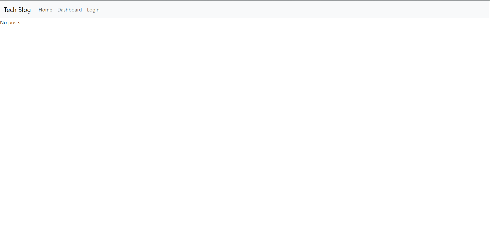

# Tech-Blog
  ## Description
  This is a CMS style blog which follows the MVC paradigm
  # Table of Contents
  1. [Description](#description)
  2. [Table of Contents](#table-of-contents)
  3. [What was the motivation?](#what-was-the-motivation)
  4. [Why did I build it?](#why-did-i-build-it)
  5. [What problem does it solve?](#what-problem-does-it-solve)
  6. [What did I learn?](#what-did-i-learn)
  7. [License Section](#license-section)
  8. [Installation](#installation)
  9. [Usage](#usage)
  10. [Contributions](#contributions)
  11. [Tests](#tests)
  12. [Questions?](#questions)
  ## What was the motivation?
  I wanted to build a place where developers could post content
  ## Why did I build it?
  I built it to further my knowledge of the MVC paradigm
  ## What problem does it solve?
  It solves the problem of giving developers a place to interact with each other
  ## What did I learn?
  I learned how to use Express-session to persist user data and how to use Express-handlebars
  ## License Section
  [MIT license link](https://opensource.org/licenses/MIT)
  ## Installation
  No installation require
  ## Usage
  Go to the website listed below and create an account
  ## Contributions
  None
  ## Tests
  None
  ## Questions?
  Cyril1743
  16daivd.love@gmail.com
  ## Link to deployed application
  [Link to the deployed application](https://safe-journey-37728.herokuapp.com/)
  ## Screenshot
  
